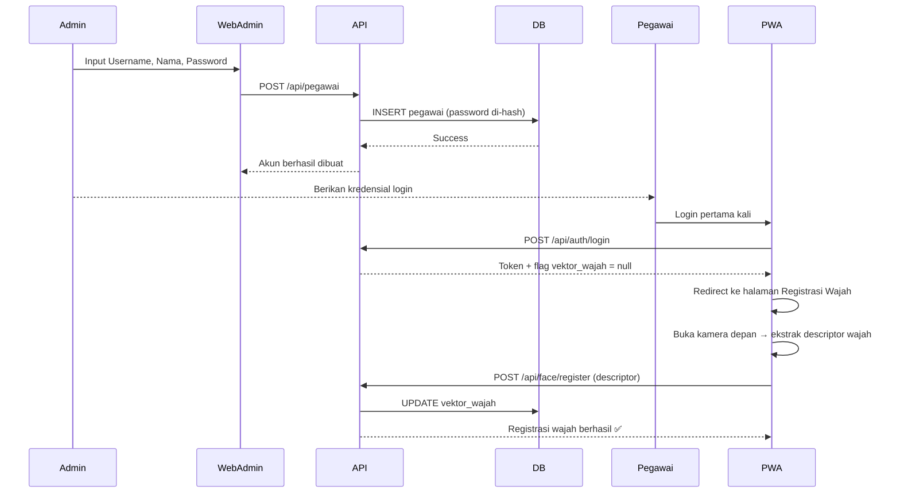
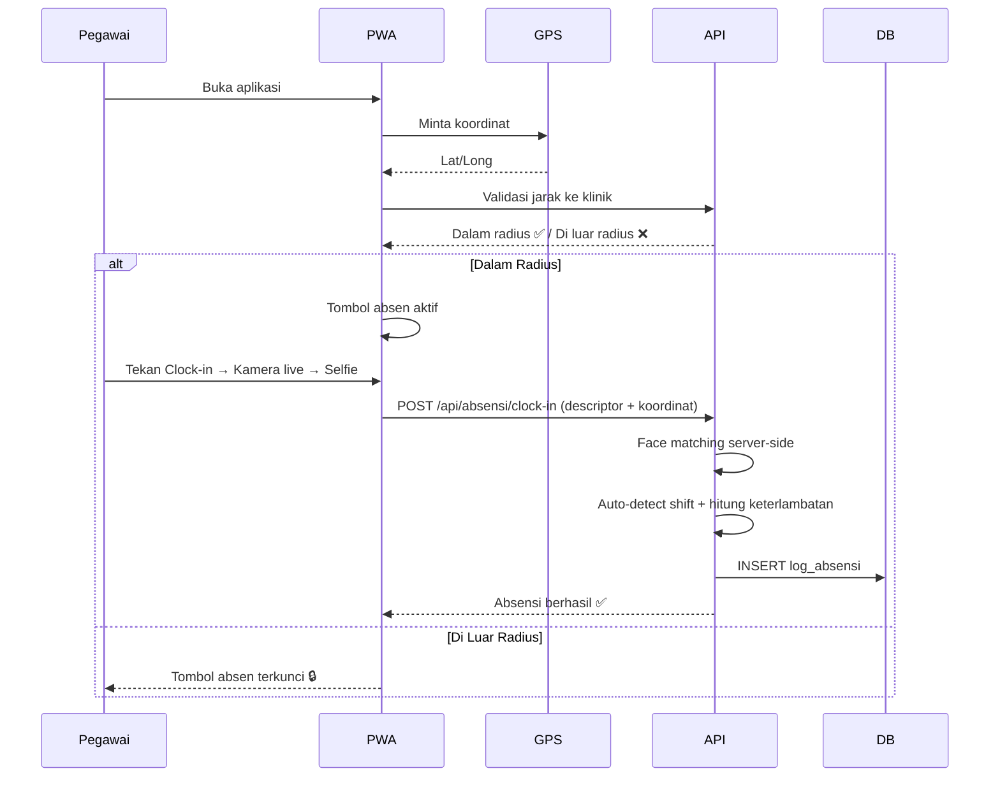
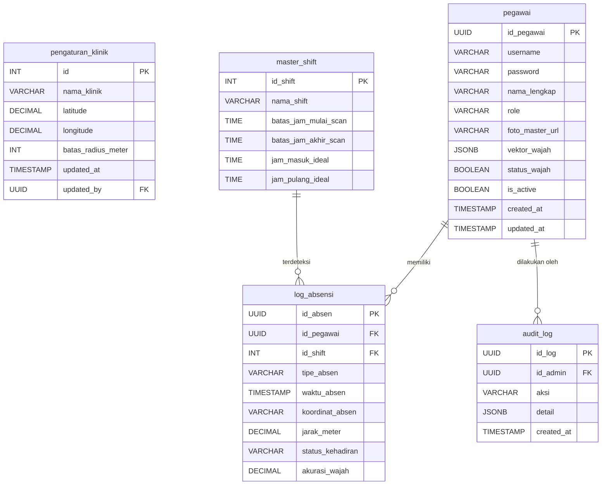

# 📄 Product Requirements Document (PRD)

## Sistem Absensi Cerdas — Klinik Prima Insani

| Field | Detail |
|---|---|
| **Versi** | 1.0.0 |
| **Status** | Hardening Beta |
| **Platform** | Progressive Web App (Mobile) & Web Dashboard (Desktop) |
| **Nama Klinik** | Klinik Prima Insani |
| **Tanggal** | 8 Maret 2026; diperbarui 3 Juni 2026 |

---

## 1. Executive Summary

Sistem Absensi Cerdas Klinik Prima Insani adalah solusi perangkat lunak berbasis web yang dirancang untuk mendigitalisasi dan memperkuat proses presensi pegawai klinik. Sistem ini mengurangi risiko kecurangan absensi melalui verifikasi wajah live, validasi radius lokasi, timestamp server, proteksi absen ganda, dan dashboard admin untuk audit operasional.

---

## 2. Latar Belakang & Masalah

| # | Masalah | Dampak |
|---|---|---|
| 1 | **Kecurangan Karyawan** | Mesin fingerprint rawan antrean dan kontak fisik; aplikasi mobile biasa sangat mudah diakali menggunakan fake GPS atau upload foto lama dari galeri. |
| 2 | **Biaya Server Membengkak** | Menyimpan ratusan foto selfie absensi setiap hari membuat cloud storage cepat penuh dan biaya maintenance tinggi. |
| 3 | **Beban Administratif HRD** | Mengatur jadwal shift yang dinamis untuk puluhan pegawai secara manual sangat menyita waktu dan rentan human error. |
| 4 | **Hambatan Instalasi** | Memaksa pegawai menginstal aplikasi dari Play Store/App Store seringkali menemui kendala spesifikasi smartphone atau memori penuh. |

---

## 3. Solusi Produk

Membangun ekosistem absensi **tanpa instalasi** berbasis Progressive Web App (PWA) yang diperkuat dengan:

- **Kecerdasan Buatan** — Face Recognition API untuk verifikasi identitas.
- **Validasi Lokasi** — Geo-fencing untuk memastikan kehadiran fisik.
- **Otomasi Shift** — Algoritma deteksi shift otomatis berdasarkan waktu clock-in.

---

## 4. Arsitektur & Teknologi (Tech Stack)

| Layer | Teknologi |
|---|---|
| **Front-End (PWA Pegawai)** | HTML5, CSS3, Vanilla JavaScript |
| **Front-End (Web Admin)** | HTML5, CSS3, Tailwind CSS |
| **Back-End (API Server)** | Node.js, Express.js |
| **AI & Image Processing** | face-api.js (TensorFlow.js) di browser, server-side descriptor matching |
| **Database (BaaS)** | Supabase (PostgreSQL) |
| **Authentication** | JWT (JSON Web Token) + Bcrypt |
| **Maps** | Backlog; saat ini menyimpan koordinat dan jarak |
| **Export** | Backlog; riwayat presensi tersedia di dashboard |

### 4.1 Arsitektur Diagram (High-Level)

```
┌─────────────────────┐   HTTPS    ┌─────────────────────────┐
│  PWA Pegawai        │ ────────── │  Node.js + Express.js   │
│  (Mobile Browser)   │            │  (API Server)           │
└─────────────────────┘            │                         │
                                   │  ┌───────────────────┐  │
┌─────────────────────┐            │  │ Descriptor Match  │  │
│  Web Admin          │ ────────── │  │ + Business Rules  │  │
│  (Desktop Browser)  │            │  └───────────────────┘  │
└─────────────────────┘            │                         │
                                   └───────────┬─────────────┘
                                               │
                                               ▼
                                   ┌─────────────────────────┐
                                   │  Supabase (PostgreSQL)  │
                                   └─────────────────────────┘
```

---

## 5. Fitur Utama (Core Features)

### A. Modul Pegawai (Front-End PWA)

> Fokus pada antarmuka yang bebas hambatan (*frictionless*) dan pengumpulan data yang valid.

| # | Fitur | Deskripsi |
|---|---|---|
| A1 | **Self-Service Biometric Onboarding** | Saat login perdana, sistem mendeteksi ketiadaan data biometrik dan mengarahkan pegawai untuk registrasi wajah. Data wajah diekstrak menjadi **128 angka vektor** dan disimpan sebagai descriptor. |
| A2 | **Strict Live-Capture Camera** | Proses absen memakai stream kamera live di halaman PWA; absensi tidak menerima upload file gambar sebagai input. |
| A3 | **Dynamic Geo-Fencing** | PWA mengecek lokasi, dan API tetap memvalidasi koordinat server-side sebelum menyimpan absensi. |
| A4 | **Transparent Dashboard** | Layar utama minimalis menampilkan jam real-time dari server, status kehadiran hari ini, dan riwayat absen personal 30 hari terakhir. |
| A5 | **Offline Awareness** | PWA mendeteksi status koneksi internet dan menampilkan notifikasi jika sedang offline. Absensi tidak diizinkan saat offline untuk menjaga integritas data geo-fencing dan face matching. |
| A6 | **PWA Install Prompt** | Menampilkan prompt "Add to Home Screen" agar pegawai dapat mengakses PWA layaknya aplikasi native tanpa melalui app store. |

### B. Modul Keamanan & Logika (Back-End API)

> Otak utama yang menjalankan komputasi berat dan mengambil keputusan secara mandiri.

| # | Fitur | Deskripsi |
|---|---|---|
| B1 | **Smart Auto-Shift Detection** | API mengkategorikan shift otomatis berdasarkan waktu clock-in. Logic: `04:00–11:59 = Shift Pagi (patokan 07:00)`, `12:00–20:00 = Shift Siang (patokan 14:00)`. |
| B2 | **Auto-Late Calculation** | Menghitung selisih waktu clock-in dengan jam patokan shift untuk memberi cap "Tepat Waktu" atau "Terlambat". |
| B3 | **Server-Enforced Face Matching** | API menghitung Euclidean Distance antara descriptor wajah live dan descriptor master. Match valid saat distance < 0.35. |
| B4 | **Descriptor-Only Daily Attendance** | Foto selfie harian tidak diarsipkan; absensi mengirim descriptor live, dan database menyimpan descriptor master serta log ringkas. |
| B5 | **Anti-Duplicate Attendance** | API menolak clock-in/clock-out ganda dalam periode shift yang sama melalui process lock dan unique index harian berbasis WIB. |
| B6 | **Rate Limiting** | Proteksi endpoint API dari penyalahgunaan (brute force login, spam request) menggunakan express-rate-limit. |
| B7 | **Server-Side Timestamp** | Waktu absensi diambil dari clock server (bukan dari client) untuk mencegah manipulasi waktu di sisi pegawai. |

### C. Modul Manajemen (Web Dashboard Admin)

> Pusat kendali visual bagi HRD/Manajemen untuk memantau operasional.

| # | Fitur | Deskripsi |
|---|---|---|
| C1 | **Real-time Overview** | Dashboard statistik harian (Hadir, Telat, Alpa) dan live-feed timeline pergerakan absen pegawai. |
| C2 | **Hands-free Employee Management** | Pembuatan akun pegawai baru hanya membutuhkan Nama dan Username. Pendaftaran wajah diserahkan ke pegawai masing-masing. |
| C3 | **Biometric Moderation & Reset** | Admin dapat mereset descriptor wajah pegawai jika registrasi terindikasi tidak valid. |
| C4 | **Location Evidence** | Dashboard menampilkan koordinat, jarak lokasi absen, dan skor verifikasi wajah sebagai bukti audit. Tampilan peta interaktif masih backlog. |
| C5 | **Attendance History Review** | Admin dapat meninjau riwayat presensi. Export Excel/PDF masih backlog. |
| C6 | **Dynamic Clinic Settings** | Antarmuka untuk mengubah titik koordinat (Lat/Long) pusat klinik dan batas radius meter tanpa menyentuh source code. |
| C7 | **Audit Log Viewer** | Menampilkan log aktivitas admin (siapa menambah/menghapus pegawai, siapa mereset wajah, kapan setting diubah) untuk akuntabilitas. |
| C8 | **Bulk Employee Import** | Backlog untuk upload CSV/Excel. Saat ini pegawai dibuat satu per satu oleh admin. |

---

## 6. Peran & Hak Akses (Role-Based Access Control)

| Peran | Hak Akses |
|---|---|
| **Pegawai** | Login PWA, mendaftar wajah sendiri, melakukan clock-in/clock-out, melihat riwayat absen pribadi. |
| **Admin** | Semua hak Pegawai + kelola data pegawai, moderasi wajah, akses dashboard statistik, ekspor laporan, ubah pengaturan klinik, melihat audit log. |
| **Super Admin** *(opsional, fase 2)* | Semua hak Admin + kelola akun Admin lain, akses konfigurasi sistem lanjutan. |

---

## 7. Alur Pengguna (User Journey)

### Flow 1: Pendaftaran Pegawai Baru



### Flow 2: Absensi Harian (Clock-in)



### Flow 3: Clock-out

1. Pegawai membuka PWA di akhir shift.
2. PWA memverifikasi GPS (dalam radius).
3. Pegawai tekan tombol Clock-out → Kamera live → Selfie.
4. API melakukan face matching, mencatat log dengan `tipe_absen = "PULANG"`.
5. Notifikasi berhasil di layar PWA.

### Flow 4: Admin Mereview & Reset Wajah

1. Admin membuka Dashboard → Menu Pegawai.
2. Admin melihat daftar pegawai beserta status registrasi wajah.
3. Jika terdeteksi wajah tidak valid → Admin klik "Reset Wajah".
4. API menghapus `vektor_wajah` dan `foto_master_url` di database.
5. Pegawai wajib registrasi wajah ulang saat login berikutnya.

---

## 8. Skema Database (PostgreSQL via Supabase)

Sistem dirancang dengan **4 tabel utama + 1 tabel audit** agar sangat dinamis dan scalable.

### 8.1 Tabel `pengaturan_klinik` (Konfigurasi Global)

| Kolom | Tipe | Keterangan |
|---|---|---|
| `id` | INT, PK | Auto-increment |
| `nama_klinik` | VARCHAR | "Klinik Prima Insani" |
| `latitude` | DECIMAL | Latitude pusat klinik |
| `longitude` | DECIMAL | Longitude pusat klinik |
| `batas_radius_meter` | INT | Default: 50 |
| `updated_at` | TIMESTAMP | Terakhir diubah |
| `updated_by` | UUID, FK | Admin yang mengubah |

### 8.2 Tabel `master_shift` (Logika Deteksi)

| Kolom | Tipe | Keterangan |
|---|---|---|
| `id_shift` | INT, PK | Auto-increment |
| `nama_shift` | VARCHAR | "Pagi", "Siang" |
| `batas_jam_mulai_scan` | TIME | e.g. 04:00:00 |
| `batas_jam_akhir_scan` | TIME | e.g. 11:59:59 |
| `jam_masuk_ideal` | TIME | e.g. 07:00:00 (penentu keterlambatan) |
| `jam_pulang_ideal` | TIME | e.g. 14:00:00 |

### 8.3 Tabel `pegawai` (Master Data Pengguna)

| Kolom | Tipe | Keterangan |
|---|---|---|
| `id_pegawai` | UUID, PK | Auto-generate |
| `username` | VARCHAR, UNIQUE | Login credential |
| `password` | VARCHAR | Hashed (Bcrypt) |
| `nama_lengkap` | VARCHAR | Nama tampilan |
| `role` | VARCHAR | "pegawai" / "admin" — Default: "pegawai" |
| `foto_master_url` | VARCHAR, Nullable | Kolom legacy/opsional; implementasi utama memakai descriptor |
| `vektor_wajah` | JSONB, Nullable | Array 128 angka dari face-api.js |
| `status_wajah` | BOOLEAN | Default: false |
| `is_active` | BOOLEAN | Default: true (soft-delete) |
| `created_at` | TIMESTAMP | Auto-generate |
| `updated_at` | TIMESTAMP | Auto-update |

### 8.4 Tabel `log_absensi` (Data Transaksional)

| Kolom | Tipe | Keterangan |
|---|---|---|
| `id_absen` | UUID, PK | Auto-generate |
| `id_pegawai` | UUID, FK | Referensi ke pegawai |
| `id_shift` | INT, FK | Diisi otomatis oleh API |
| `tipe_absen` | VARCHAR | "MASUK" / "PULANG" |
| `waktu_absen` | TIMESTAMPTZ | Jam presisi server |
| `koordinat_absen` | VARCHAR | "Lat, Long" |
| `jarak_meter` | DECIMAL | Jarak pegawai dari titik klinik saat absen |
| `status_kehadiran` | VARCHAR | "Tepat Waktu" / "Terlambat" |
| `akurasi_wajah` | DECIMAL | Skor kemiripan descriptor (e.g. 0.95) |

### 8.5 Tabel `audit_log` (Jejak Aktivitas Admin) — *Baru*

| Kolom | Tipe | Keterangan |
|---|---|---|
| `id_log` | UUID, PK | Auto-generate |
| `id_admin` | UUID, FK | Admin yang melakukan aksi |
| `aksi` | VARCHAR | "CREATE_PEGAWAI", "RESET_WAJAH", "UPDATE_SETTING", dll. |
| `detail` | JSONB | Konteks tambahan (e.g. id pegawai yang direset) |
| `created_at` | TIMESTAMP | Waktu aksi |

### 8.6 Entity Relationship Diagram



---

## 9. API Endpoints

### 9.1 Authentication

| Method | Endpoint | Deskripsi |
|---|---|---|
| POST | `/api/auth/login` | Login pegawai/admin → return JWT |
| POST | `/api/auth/logout` | Invalidasi token |

### 9.2 Pegawai

| Method | Endpoint | Deskripsi |
|---|---|---|
| GET | `/api/pegawai` | List semua pegawai (Admin only) |
| POST | `/api/pegawai` | Tambah pegawai baru (Admin only) |
| PUT | `/api/pegawai/:id` | Update data pegawai (Admin only) |
| DELETE | `/api/pegawai/:id` | Soft-delete pegawai (Admin only) |

### 9.3 Face Recognition

| Method | Endpoint | Deskripsi |
|---|---|---|
| POST | `/api/face/register` | Registrasi descriptor wajah |
| POST | `/api/face/match` | Matching descriptor wajah live vs descriptor master |
| DELETE | `/api/face/reset/:id` | Reset vektor wajah pegawai (Admin only) |

### 9.4 Absensi

| Method | Endpoint | Deskripsi |
|---|---|---|
| POST | `/api/absensi/clock-in` | Clock-in (descriptor + koordinat) |
| POST | `/api/absensi/clock-out` | Clock-out (descriptor + koordinat) |
| GET | `/api/absensi/history` | Riwayat absen pegawai (self/admin) |
| GET | `/api/absensi/today` | Statistik absen hari ini (Admin) |

### 9.5 Settings & Utilities

| Method | Endpoint | Deskripsi |
|---|---|---|
| GET | `/api/settings` | Ambil pengaturan klinik |
| PUT | `/api/settings` | Update pengaturan klinik (Admin only) |
| GET | `/api/shift` | List konfigurasi shift |
| PUT | `/api/shift/:id` | Update konfigurasi shift (Admin only) |
| GET | `/api/audit-log` | List audit log (Admin only) |
| GET | `/api/server-time` | Ambil waktu server (untuk sinkronisasi clock PWA) |

---

## 10. Non-Functional Requirements

| Kategori | Requirement |
|---|---|
| **Performance** | Face extraction di browser dan matching di API ditargetkan selesai dalam **≤ 5 detik** pada koneksi normal. |
| **Security** | API wajib menggunakan JWT. Password di-hash dengan Bcrypt (salt rounds ≥ 10). HTTPS wajib di production. |
| **Cost** | Memanfaatkan Supabase Free Tier; storage ditekan dengan menyimpan descriptor dan log, bukan arsip foto harian. |
| **Availability** | Target uptime ≥ 99% selama jam operasional klinik (06:00–22:00 WIB). |
| **Scalability** | Sistem mampu melayani hingga 100 pegawai tanpa degradasi performa. |
| **Compatibility** | PWA berjalan di Chrome, Safari, Firefox, Edge versi modern (2 tahun terakhir). |
| **Responsiveness** | PWA dioptimalkan untuk viewport mobile (360px–428px). Web Admin untuk desktop (≥ 1024px). |
| **Data Retention** | Log absensi disimpan minimal 12 bulan. Data lebih lama dari itu auto-archive atau soft-delete. |
| **Accessibility** | PWA mudah digunakan oleh pegawai non-teknis. Antarmuka intuitif, minim teks instruksi. |

---

## 11. Error Handling & Edge Cases

| Skenario | Penanganan |
|---|---|
| GPS tidak tersedia / ditolak user | Tampilkan pesan error yang jelas. Tombol absen tetap terkunci. |
| Kamera tidak tersedia / ditolak user | Tidak bisa melanjutkan proses absen. Tampilkan instruksi cara mengaktifkan izin kamera. |
| Wajah tidak terdeteksi di kamera | PWA menampilkan pesan "Wajah tidak terdeteksi, silakan foto ulang". |
| Descriptor wajah tidak cocok | Absen ditolak. Tampilkan pesan "Verifikasi wajah gagal". |
| Pegawai sudah clock-in di shift yang sama | API menolak dengan pesan "Anda sudah melakukan clock-in hari ini". |
| Internet putus saat proses absen | Tampilkan error timeout/network dan sarankan untuk coba lagi. |
| Token JWT expired | Auto-redirect ke halaman login. |
| Server down | PWA menampilkan halaman fallback "Sistem sedang dalam pemeliharaan". |
| Pegawai mencoba absen di luar jam shift | API menolak dan menampilkan pesan "Di luar jam operasional shift". |

---

## 12. Keamanan Tambahan

| Aspek | Detail |
|---|---|
| **CORS** | API hanya menerima request dari origin PWA dan Web Admin yang terdaftar. |
| **Helmet.js** | Backlog untuk hardening header HTTP tambahan. |
| **Input Validation** | Input utama divalidasi server-side melalui helper validasi internal. |
| **File Upload** | Tidak dipakai untuk absensi harian; flow utama memakai descriptor wajah. |
| **SQL Injection** | Dicegah melalui parameterized queries dari Supabase client library. |
| **Token Expiry** | Access token berlaku 8 jam (1 shift kerja). Refresh token opsional. |

---

## 13. Roadmap & Fase Pengembangan

### Fase 1 — MVP (Target: 4 minggu)

- [x] Setup project structure (back-end + front-end)
- [x] Database schema di Supabase
- [x] Auth system (login, JWT, Bcrypt)
- [x] CRUD Pegawai (Web Admin)
- [x] Face Registration & Matching (face-api.js descriptor)
- [x] Geo-fencing + Clock-in/Clock-out
- [x] Auto-shift detection + late calculation
- [x] Dashboard Admin (statistik hari ini)
- [x] Riwayat absen pegawai
- [x] Audit log admin
- [x] PWA install prompt & offline page
- [x] Dynamic clinic settings UI

### Fase 2 — Enhancement (Target: 2 minggu setelah MVP)

- [ ] Export Excel/PDF
- [ ] Bulk import pegawai (CSV)
- [ ] Geospatial Map View di dashboard

### Fase 3 — Future (Opsional)

- [ ] Notifikasi WhatsApp/Telegram saat pegawai terlambat
- [ ] Multi-klinik (cabang) support
- [ ] Super Admin role
- [x] Integrasi kalender libur nasional
- [ ] Laporan bulanan otomatis via email
- [ ] Dark mode PWA

---

## 14. Metrik Keberhasilan (Success Metrics)

| Metrik | Target |
|---|---|
| Tingkat kecurangan absensi | Turun signifikan melalui kombinasi face matching, geo-fencing, timestamp server, dan audit log |
| Waktu proses absensi per pegawai | **≤ 15 detik** (buka app → selesai) |
| Biaya cloud storage bulanan | **< $1/bulan** (Free Tier Supabase) |
| Waktu HRD untuk rekap absensi | Turun melalui dashboard riwayat dan statistik; export otomatis masuk backlog |
| Adopsi pegawai dalam 1 bulan | **100%** pegawai aktif |

---

## 15. Batasan & Asumsi (Constraints & Assumptions)

### Batasan

- Sistem absensi **hanya bisa dilakukan saat online** (tidak ada mode offline queue).
- Face matching bergantung pada pencahayaan yang cukup saat selfie.
- Akurasi GPS bergantung pada kualitas sensor GPS perangkat pegawai.

### Asumsi

- Semua pegawai memiliki smartphone dengan kamera depan dan GPS.
- Klinik memiliki koneksi WiFi yang stabil di area kerja.
- Browser yang digunakan pegawai mendukung API MediaDevices (getUserMedia) dan Geolocation.
- Supabase Free Tier cukup untuk skala awal (≤ 50 pegawai aktif).

---

> [!IMPORTANT]
> Dokumen ini merupakan **panduan utama pengembangan (Single Source of Truth)** untuk seluruh fase pengerjaan proyek Sistem Absensi Cerdas Klinik Prima Insani.
